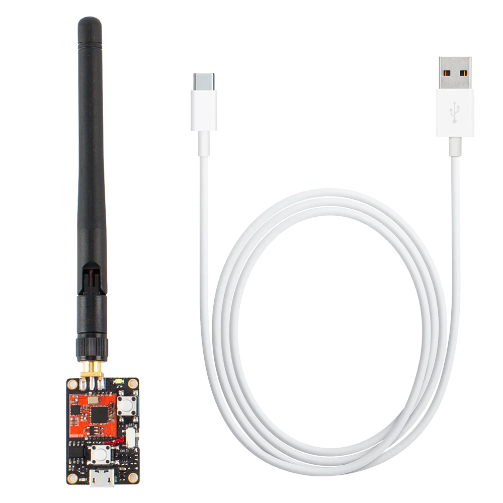
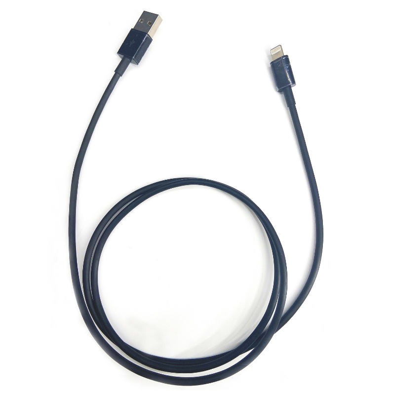
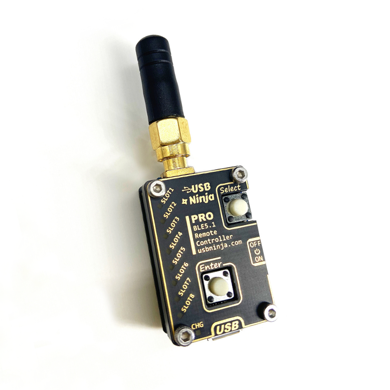
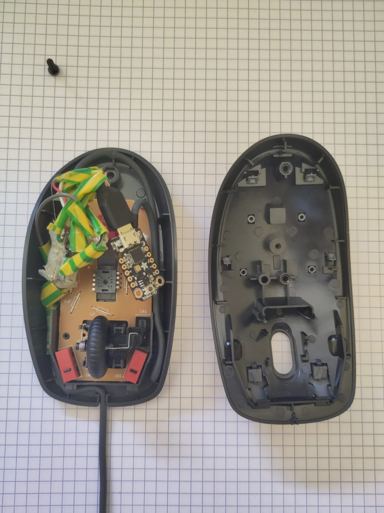

# attack_vector

This folder contains information regarding the attack vector (i.e., USB Ninja cable, USB Ninja cable pro. and maliciously modified mouse). USB Ninja cable and USB ninja cable pro are HID and bluetooth-capable devices that can respectively be triggered or receive keystrokes from BLE. The maliciously tampered mouse presented here contains a HID-capable device. 

## Structure

### Folders

- `sniffing`: Folder containing the `nRF Sniffer for Bluetooth Development tool`. To find the BLE packets to send to the USB Ninja cables I had to sniff the communication between the devices (while trigger them with associated remote). To sniff the communication I used the [`nRF52840 MDK USB Dongle`](https://wiki.makerdiary.com/nrf52840-mdk-usb-dongle/) and the [`Wireshark`](https://www.wireshark.org/) software (See [this](https://wiki.makerdiary.com/nrf52840-mdk-usb-dongle/guides/nrf802154-sniffer/#requirements), or [this](https://novelbits.io/nordic-ble-sniffer-guide-using-nrf52840-wireshark/) tutorials).
  
- `malicious_mouse`: Folder containing information regarding the maliciously modified mouse.

### Files

- `bluetooth_send_ninja.py`: PoC script to trigger payload `A` or `B` of the the USB Ninja cable over BLE without the remote. (Windows OS required)

- `bluetooth_send_ninja_pro.py`: PoC script to send keystrokes to the USB Ninja cable pro. over BLE without the remote. (Windows OS required)

## How to use ? 

### USB Ninja cable 

The USB Ninja cable can be bought in the [Lab401 website](https://lab401.com/products/usbninja).

Information regarding the USB Ninja cable can be found in the [USBNinjaRRG/USBNinja github](https://github.com/USBNinjaRRG/USBNinja) and in the [4d4c/USBNinja github](https://github.com/4d4c/USBNinja).

By default the USB Ninja cable can be remotely controlled (i.e., trigger payload `A` or `B`) only via the remote. But you will find in the `bluetooth_send_ninja.py` file a PoC script to trigger payload `A` or `B` of the the USB Ninja cable over BLE without the remote.

Thanks to the [Embedded Lab Vienna for IoT & Security](https://wiki.elvis.science/index.php?title=Embedded_Lab_Vienna_for_IoT_%26_Security:About) for their help on how to trigger the USB Ninja cable. Please contact them to have info about how to control the USB Ninja cable on LINUX OS. 

### USB Ninja cable professional

The USB Ninja cable pro. can be bought on the [sneaktechnology website](https://sneaktechnology.com/pentest-engagement-scenario/badusb/).

Information regarding the USB Ninja cable pro. can be found in the [USBNinjaRRG/USBNinjaProfessional github](https://github.com/USBNinjaRRG/USBNinjaProfessional).

By default the USB Ninja cable pro. can be remotely controlled (e.g., send keystrokes, trigger one of the ten payloads, etc.) only via the remote. But you will find in the `bluetooth_send_ninja_pro.py` file a PoC script to send keystrokes to the USB Ninja cable pro. over BLE without the remote. (Windows OS required)

### Maliciously tampered mouse

The maliciously tampered mouse is made of a :
- `Logitech M90` USB wired mouse
- `DIY Tiny USB Hub` (can be bought [here](https://www.retrocution.com/product/tiny-usb-hub-2-port/), [here](https://www.smart-prototyping.com/NanoHub-tiny-USB-hub-for-hacking-projects) or can be [own-made](https://www.retrocution.com/2020/01/15/easy-diy-tiny-usb-hub-for-raspberry-pi-projects/))
- `Micro USB male connector` (can be made from any micro USB cable with data transmission)
- Any HID-capable microcontroller with a `Micro USB female connector ` (I used the [`Adafruit Trinket M0`](https://www.adafruit.com/product/3500)).

The mouse can not be remotely controlled (as the `Adafruit Trinket M0` has no wireless communication).

Information regarding this maliciously tampered mouse can be found in [`/malicious_mouse` folder](https://github.com/grennault/NinjaCrane/tree/main/Attacks/attack_vector/malicious_mouse).

