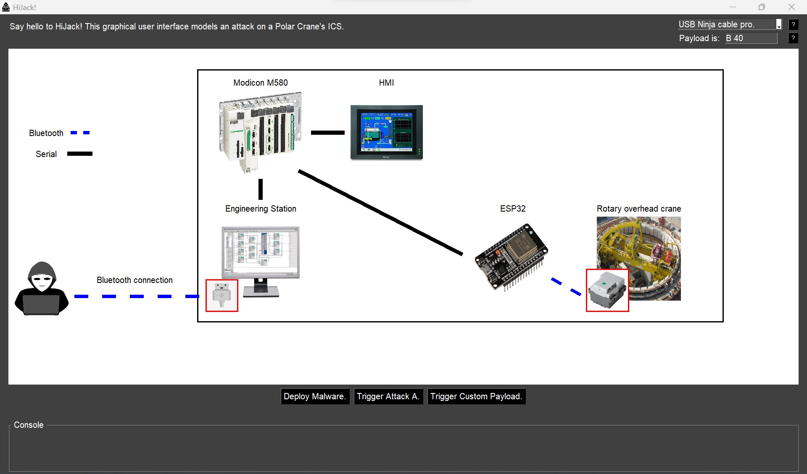

# HiJack, (Amazing) Graphical User Interface

This folder contains the graphical user interface (gui) of the attacker. The attacker needs to run this GUI on a bluetooth-compatible device.

## Requirement

- OS: Windows ONLY (I apologize for this but the `HiJack.py` script can easily be modified to run on UNIX-based OS using the `bluepy` package).
- Bluetooth-capable (e.g., laptop or use of a Bluetooth dongle).

Python packages :

- `cv2`
- `PIL`
- `matplotlib`
- `numpy`
- `PySimpleGUI`
- `pybluez` (For windows, requires `pip install setuptools==58` and C++ build tools `https://visualstudio.microsoft.com/visual-cpp-build-tools/`)

(See `requirements.txt` file for exact version. Generated with `pipreqs --force path/to/gui` command. Python packages can all be installed in once with `pip install -r path/to/gui/requirements.txt`)

## Structure

### Files

- `HiJack.py` : Main file, run this file to launch the gui.
- `HiJack.exe` : Executable file of `HiJack.py`, run this file to run the gui without `python`.
- `Bluetooth.py` : Bluetooth functions, used to trigger the USB Ninja cable payload and to send keystrokes to the USB Ninja cable pro. A BIG THANK YOU to the Embedded Lab Vienna for IoT & Security and its ELVIS project for their help. See [Exploiting the USB Ninja BLE Connection Wiki page](https://wiki.elvis.science/index.php?title=Exploiting_the_USB_Ninja_BLE_Connection).
- `requirements.txt` : Python packages required to run the gui.
- `README.md` : This file.

### Folders

- `img` : Contains all the images used in the gui.
- `research` : Contains python script used for research/improvement purpose.

## How to use ?

Run `HiJack.py` !

I.e. : `python HiJack.py`.

## Don't want to use python ? No problem run `HiJack.exe` file !

The `HiJack.exe` file has been generate using `pyinstaller --noconfirm --onefile --console --add-data "C:/Users/user/***TO_COMPLETE***/MSc_Project/gui/img;img/"  "C:/Users/user/***TO_COMPLETE***/MSc_Project/gui/HiJack.py"` (OR using the easier to use `auto-py-to-exe`)
